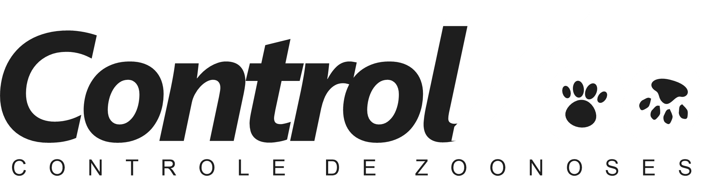

# ControlZoo

  

ControlZoo é um aplicativo mobile para gerenciar a carteira de vacinação dos seus pets. Este projeto foi desenvolvido usando React Native e Expo.

## Descrição

Plataforma digital integrada que conecta tutores de pets, veterinários e
entidades governamentais, promovendo a saúde e o bem-estar animal.
Com funcionalidades que facilitam o acompanhamento de vacinas,
banhos, tosas e alertas de zoonoses, o aplicativo busca oferecer
praticidade e eficiência no cuidado dos pets.

## Público-alvo

Nosso foco principal são tutores de pets e profissionais veterinários que
desejam uma ferramenta prática e confiável para gerenciar a saúde e o
bem-estar animal. As entidades governamentais também se
beneficiam do sistema no alerta para prevenção de zoonoses.

## Contexto do Problema

O mercado pet carece de soluções integradas que centralizem
informações sobre os cuidados de saúde animal.
Muitos tutores enfrentam dificuldades em acompanhar vacinas e
cuidados preventivos, enquanto veterinários lidam com a falta de
sistemas eficientes para acessar históricos clínicos.
A plataforma visa suprir essas lacunas, melhorando a qualidade de vida
dos animais e promovendo saúde pública.

## Autores

Seu app completo para bem-estar dos pets.

Desenvolvido por:
- Anderson Santos de Souza
- Caio Franca Lucena
- Dâmaris de Andrade Castro
- Flávia Rodrigues dos Santos
- Guilherme Bacelar dos Santos Soares
- Kethely Thaylane Souza Tavares
- Lara Gabrielle Nogueira dos Santos
- Lucas Gabriel Alcantara Silva
- Vitor Miranda Sousa
- Wallisson da Silva Dias
